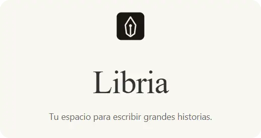

[](https://github.com/Gargadon/libria/actions/workflows/release.yml)

# Libria — Shelley Edition



**Libria** es un entorno de escritura profesional diseñado para autores que buscan el control total sobre su obra, desde el primer borrador hasta la maquetación final. Reúne en una única aplicación de escritorio las herramientas de edición, diseño tipográfico, revisión editorial y exportación que normalmente requieren múltiples plataformas.

---

## Características Principales

### Edición por Bloques y Organización

Libria abandona el concepto de "página en blanco" tradicional por un sistema de **edición basada en bloques** (contenteditable), permitiendo una estructura semántica clara:

- **Secciones especializadas:** Preliminares (`halftitle`, `title`, `subtitle`, `author`, `publisher`, `dedication`, `chapter-num`), cuerpo de la obra y posliminares.
- **Estados de capítulo:** Control visual del progreso (Borrador, Esquema, Listo) con indicadores de color.
- **Métricas en tiempo real:** Recuento de palabras y tiempo de lectura estimado por capítulo y total.
- **Bloques enriquecidos:** Párrafos, títulos, citas, saltos de escena, saltos de página, imágenes y más.
- **Imágenes:** Inserción desde el portapapeles (Ctrl+V), desde el panel de attachments o cargando archivos. Rotación (90°, 180°, 270°), volteo horizontal y vertical, con ajuste automático de orientación EXIF. Las transformaciones se reflejan en todas las previsualizaciones (Kindle, iPhone y Papel).
- **Reordenación de capítulos:** Botones de subir/bajar en el panel lateral para reposicionar capítulos dentro de su sección (preliminares, cuerpo, posliminares).
- **Búsqueda y reemplazo global:** Vista de contexto con coincidencias resaltadas.

### Maquetación Tipográfica de Alto Nivel

Un panel de control con parámetros ajustables para ver cómo quedará tu libro mientras lo escribes:

- **Temas de Libro Personalizados:** Creación y diseño de temas propios (guardando la configuración tipográfica actual del panel de maquetación). Los temas personalizados se guardan localmente y pueden **exportarse** (como archivos `.libria-theme`) e **importarse** fácilmente desde la interfaz.
- **Temas Predefinidos:** Opciones integradas como *Clásico*, *Moderno* y *Minimalista* (este último con ajustes específicos como remoción de márgenes superiores).
- **Tipografía:** Spectral, Lora, EB Garamond, Crimson Pro, Inter, Montserrat — y cualquier fuente instalada en tu sistema (con campos personalizados para fuente del libro y de títulos).
- **Control absoluto:** Márgenes (interior/exterior/superior/inferior), interlineado, espaciado de párrafos, sangrías, justificación y alineación.
- **Detalles profesionales:** Letras capitulares (drop caps), guionización automática en 5 idiomas, **comillas inteligentes**, **guiones em/en**, **puntos suspensivos tipográficos** y **signos de apertura inteligentes**.
- **Encabezados y pies:** Texto personalizado, numeración de página con posición configurable.
- **Paginación dinámica:** Previsualiza en formatos estándar (5×8, 6×9, A5, A4, A6, Carta) o simulando dispositivos Kindle o iPhone.

### Revisión Ortográfica Integrada

El editor utiliza el corrector del WebView del sistema para subrayar errores y mostrar sugerencias. Los idiomas disponibles dependen de los diccionarios del sistema. Las diferencias del diccionario personal respecto a Electron están descritas en [la guía de Tauri](docs/tauri.md).

### Notas al Pie

Sistema completo de notas al pie para libros técnicos y de no ficción:

- **Inserción inline:** Referencias numéricas en el texto con contenido expandible.
- **Exportación EPUB:** Panel de notas al pie generado automáticamente en EPUB.
- **Exportación ODT:** Soporte de notas al pie nativas en formato ODT para procesadores de texto.
- **Ordenación:** Notas ordenadas por posición dentro del capítulo.

### Flujo Editorial y Revisión

Diseñado para el trabajo colaborativo entre autores y editores:

- **Notas marginales:** Comenta fragmentos específicos del texto con hilos de discusión.
- **Roles definidos:** Autor, Editor, Corrector y Editorial.
- **Hilos de conversación:** Respuestas anidadas para discutir cambios estilísticos o estructurales.
- **Control de estado:** Marca notas como resueltas o no aplicables.

### Fichas Creativas (Worldbuilding)

- **Sin plantillas rígidas:** Fichas de personajes y lugares totalmente libres de campos obligatorios para mantener el control completo de la obra en manos del escritor.
- **Edición integrada:** Permite registrar y redactar descripciones, trasfondos o notas para cada personaje o lugar directamente en el panel lateral.
- **Persistencia:** Almacenamiento directo en el formato abierto `.libria`.

### Experiencia de Escritura

- **Modo Zen:** Ocultación total de la interfaz (topbar, sidebar y previsualización) para escribir sin distracciones. Acceso vía `F11` o botón en la barra.
- **Temporizador Pomodoro:** Control de ciclos de enfoque y descansos (cortos y largos) con alertas sonoras integradas en la barra superior.
- **Gráfica de rendimiento (Pacing):** Visualización del conteo de palabras por capítulo en formato SVG dinámico, con cálculo de meta de palabras diaria en base a fechas límite.
- **Tema claro/oscuro:** Alterna entre ambos modos con persistencia en preferencias personales. El tema oscuro no afecta la previsualización de dispositivos físicos.
- **Verificación de actualizaciones:** Botón dedicado en el diálogo de *Acerca de* (About) para verificar manualmente si hay nuevas versiones de la aplicación desde GitHub o mediante el actualizador automático.
- **Autoguardado:** Guardado silencioso automático cada 2 minutos si el archivo ya tiene ruta.
- **Objetivos de escritura:** Metas diarias de palabras con barra de progreso y seguimiento visual.
- **Previsualización ocultable:** Alterna la visibilidad del panel de previsualización con `Ctrl+Shift+P` para maximizar el espacio de escritura.

### Importación y Exportación

- **Importar:** Desde DOCX (con formato) y TXT (texto plano).
- **Exportación EPUB 3.0:** Estándar de la industria para distribución digital, con portada, TOC, tipografía embebida y soporte completo de listas, tablas y notas al pie.
- **Exportación DOCX:** Todos los tipos de bloque, formato enriquecido (negrita, cursiva, imágenes), tweaks tipográficos aplicados, portada y TOC opcionales.
- **Exportación PDF profesional:** Composición con Vivliostyle, CSS Paged Media, páginas recto/verso, cajas de margen, numeración real del índice y estilos tipográficos aplicados.
- **Formato abierto `.libria`:** Archivo JSON autocontenido con metadatos, preferencias, capítulos, notas, imágenes y objetivos de escritura.

### Internacionalización

Interfaz disponible en **español, inglés, francés, italiano, alemán y portugués** — conmutación en vivo desde el panel lateral.

---

## Especificaciones Técnicas

Libria está construida con las tecnologías más modernas para garantizar fluidez y seguridad:

| Componente | Tecnología |
| :--- | :--- |
| **Framework** | [Angular 22](https://angular.dev/) (standalone components) |
| **Gestión de Estado** | [NgRx Signals Store](https://ngrx.io/guide/signals) |
| **Entorno de Escritorio** | [Tauri 2](https://v2.tauri.app/) + Rust |
| **Motor de composición PDF** | [Vivliostyle](https://vivliostyle.org/) 11 |
| **Persistencia** | Formato abierto `.libria` (JSON autocontenido) |
| **Testing** | [Vitest](https://vitest.dev/) |
| **Estilos** | SCSS (Sass) por componente |
| **Lenguajes** | TypeScript 6.0 (Modo Estricto) y Rust |
| **Herramientas de desarrollo** | [Bun](https://bun.sh/) + Rust estable |
| **Corrector ortográfico** | Corrector del WebView del sistema |
| **Dependencias clave** | `@vivliostyle/cli` (PDF), `docx` (DOCX), `jszip` (EPUB), `hyphen` (guionado), `mammoth` (importación DOCX) |

### Arquitectura de Datos

El estado de la aplicación se gestiona mediante un **Signals Store** altamente optimizado que incluye:

- **Historial de Deshacer/Rehacer:** Hasta 50 snapshots de seguridad.
- **Búsqueda Global:** Motor de búsqueda indexado con contexto de coincidencias.
- **Preferencias de usuario:** Persistencia de configuración (idioma, avatar, nombre, ancho de previsualización) en LocalStorage.
- **Temas personalizados:** Carga e inicialización automática de temas del usuario a nivel de estado en el BookStore.

---

## Para Desarrolladores

### Requisitos Previos

- **Node.js**: 22.12 o superior
- **Bun**: 1.3.14 o superior
- **Rust estable** y [prerrequisitos nativos de Tauri](https://v2.tauri.app/start/prerequisites/)

El empaquetado incluye el motor PDF, que se inicia solo al exportar. Consulta los requisitos nativos, los comandos y las diferencias respecto a Electron en [la guía de Tauri](docs/tauri.md).

### Instalación y Ejecución

```bash
# 1. Clonar el repositorio
git clone https://github.com/gargadon/libria.git

# 2. Instalar dependencias
bun install

# 3. Iniciar servidor de desarrollo
bun run start          # http://localhost:4300

# 4. Iniciar con Tauri
bun run tauri:dev      # Angular + ventana Tauri

# 5. Construir para producción
bun run build

# 6. Empaquetar para distribución
bun run tauri:build
```

### Google Drive

La aplicación de escritorio permite conectar una cuenta, abrir y guardar documentos `.libria` en Drive y sincronizarlos cada 30 segundos o manualmente. Mantiene una copia local y detecta cambios en ambas versiones antes de subir. El vínculo con Drive se guarda por separado, sin modificar la estructura del documento. Incluye credenciales de aplicación ofuscadas; consulta la [configuración OAuth y sincronización](docs/google-drive.md).

### Plugins (propuesta de API)

La [especificación de plugins](docs/plugins.md) define una API pública para añadir almacenamiento, comandos y otras integraciones sin extender el formato `.libria`. Incluye un [contrato TypeScript](plugin-api/README.md) y un [ejemplo](examples/plugins/memory-storage). El cargador y el gestor todavía no están implementados.

### Scripts Disponibles

| Script | Descripción |
| :--- | :--- |
| `bun run start` | Servidor de desarrollo Angular (puerto 4300) |
| `bun run dev` | Alias de `start` |
| `bun run build` | Build de producción |
| `bun run test` | Ejecutar tests con Vitest |
| `bun run tauri:dev` | Servidor Angular + ventana Tauri |
| `bun run tauri:build` | Build + instaladores Tauri |

---

## Apoya el Proyecto

Libria es un proyecto independiente desarrollado en mi tiempo libre. Si te es útil, considera apoyar su continuidad:

| Método | Link |
| :--- | :--- |
| **GitHub Sponsors** | [Sponsor](https://github.com/sponsors/Gargadon) — 0% comisión, matching disponible |
| **PayPal** | [Donar](https://paypal.me/gargadon) |
| **Ko-fi** | [Invitarme un café](https://ko-fi.com/gargadon) |
| **Crypto** | BTC: `bc1qc8yqp6ph6gwlq83a6ytjvn90qaju8huzlgh4vacfq8j6nwmav7fsl7466e` |
| | ETH/USDT (ERC-20): `0x4093Bc150bD32DF2ba4910901A8F320FC3Ce8568` |
| | XRP (Ripple, tag `98270488`): `rLSn6Z3T8uCxbcd1oxwfGQN1Fdn5CyGujK` |

Cada aportación, por pequeña que sea, ayuda a mantener el proyecto vivo. ¡Gracias!

---

## Licencia

Este proyecto está bajo la **GNU Affero General Public License v3.0**. Consulta el archivo [LICENSE](LICENSE) para más detalles. Vivliostyle, integrado como motor de composición PDF, también se distribuye bajo AGPLv3.

---
